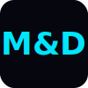

<div align="center">
  <br/>
  <a href="https://mdsoftware.com">
    
  </a>
  <br/>
  <h1 align="center">M&amp;D Desarrollo Web</h1>
  <p align="center">
    <strong>Tecnología que transforma negocios</strong>
    <br/>
    Desarrollo web · Despliegue en la nube · SEO
  </p>
  <p align="center">
    <a href="https://wa.me/523335993568" target="_blank" rel="noopener noreferrer">
      
    </a>
  </p>
  <br/>
</div>

---

## ✨ Sobre el proyecto

Sitio web corporativo de **M&amp;D Desarrollo Web**, una agencia fundada por **Mathier Mendoza Morelos** y **David Guadalupe Vargas López** especializada en:

- **Desarrollo web a medida** — Sitios corporativos, landing pages, dashboards y plataformas interactivas
- **Despliegue e infraestructura** — Publicación en la nube con AWS, Docker, Kubernetes y escalabilidad automática
- **SEO y posicionamiento** — Auditoría técnica, optimización Core Web Vitals, contenido y link building

## 🚀 Tecnologías utilizadas

| Frontend | Infraestructura | Backend |
|----------|----------------|---------|
| HTML5 + CSS3 | Docker · Kubernetes | Node.js · Python |
| JavaScript (vanilla) | AWS · Linux · Nginx | Laravel · Stripe |
| Google Fonts (Inter, JetBrains Mono) | PostgreSQL · MySQL · MariaDB | APIs REST |
| Font Awesome 6 | Cloudflare · Vercel | CI/CD con GitHub Actions |

## 🎨 Características

- ✨ Fondo interactivo con partículas conectadas (Canvas API)
- 🌈 Efecto de escritura automática (typing effect) en el hero
- 🎞️ Carrusel infinito del stack tecnológico
- 📊 Contadores animados que se activan al hacer scroll
- ⏳ Loader de carga con animación
- 📱 Diseño 100% responsive
- 🌙 Modo oscuro con acentos cian, violeta y rosa
- ♿ Semántica HTML5 y accesibilidad básica

## 🔍 SEO

Optimizado al máximo para motores de búsqueda:

- Meta tags: title, description, keywords, robots, canonical, hreflang, Dublin Core, geo tags
- Open Graph + Twitter Cards para redes sociales
- **JSON-LD** con Schema.org: `Organization`, `WebSite`, `BreadcrumbList`, `FAQPage`
- `robots.txt` y `sitemap.xml`
- `rel="noopener noreferrer"` en todos los enlaces externos
- Preconnect a Google Fonts y CDN para rendimiento

## 📁 Estructura del proyecto

```
mdsoftware.com/
├── index.html          # Página principal
├── style.css           # Estilos (tema oscuro, animaciones, responsive)
├── script.js           # Canvas particles, typing, contadores, scroll reveal
├── favicon.svg         # Favicon con logo M&D
├── robots.txt          # Configuración para crawlers
├── sitemap.xml         # Mapa del sitio
└── README.md           # Este archivo
```

## 🚀 Despliegue

El sitio es completamente estático. Puedes desplegarlo en cualquier servidor web o plataforma:

```bash
# Usando Vercel (recomendado)
npm i -g vercel
vercel

# Usando Netlify
# Arrastra la carpeta a https://app.netlify.com/drop

# O simplemente súbela a cualquier hosting (Apache, Nginx, etc.)
```

## ⚙️ Configuración

Antes de desplegar, actualiza estas variables:

| Variable | Archivo | Descripción |
|----------|---------|-------------|
| Número WhatsApp | `index.html` (varias líneas) | Reemplaza `523335993568` por el número real |
| Dominio | `index.html` (JSON-LD, canonical) | Cambia `https://mdsoftware.com/` por tu dominio real |
| Redes sociales | `index.html` (sección team) | Agrega los links reales de LinkedIn, email, etc. |

## 🧑‍💻 Equipo

<div align="center">
  <table>
    <tr>
      <td align="center">
        <a href="https://github.com/DeadZombie14">
          
          <br/>
          <sub><strong>Mathier Mendoza</strong></sub>
          <br/>
          <sub>Director de Infraestructura</sub>
        </a>
      </td>
      <td align="center">
        <a href="https://github.com/David-1212">
          
          <br/>
          <sub><strong>David Vargas</strong></sub>
          <br/>
          <sub>Director de Software</sub>
        </a>
      </td>
    </tr>
  </table>
</div>

## 📄 Licencia

© 2026 **M&amp;D Desarrollo Web**. Todos los derechos reservados.

---

<div align="center">
  <a href="https://wa.me/523335993568" target="_blank" rel="noopener noreferrer">
    <b>📱 Cotiza tu proyecto por WhatsApp</b>
  </a>
  <br/>
  <sub>Hecho con tecnología y propósito en México 🇲🇽</sub>
</div>
